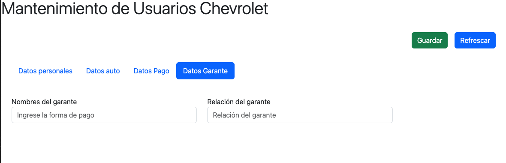

# VmtDevNg

This project was generated with [Angular CLI](https://github.com/angular/angular-cli) version 17.3.8.

## Development server

Run `ng serve` for a dev server. Navigate to `http://localhost:4200/`. The application will automatically reload if you change any of the source files.

## Integrantes
- Jeyson Jaramillo
- Jesus Rosales

### Funcionamiento

El login ....

  

## Lista personas

La lista ....
img